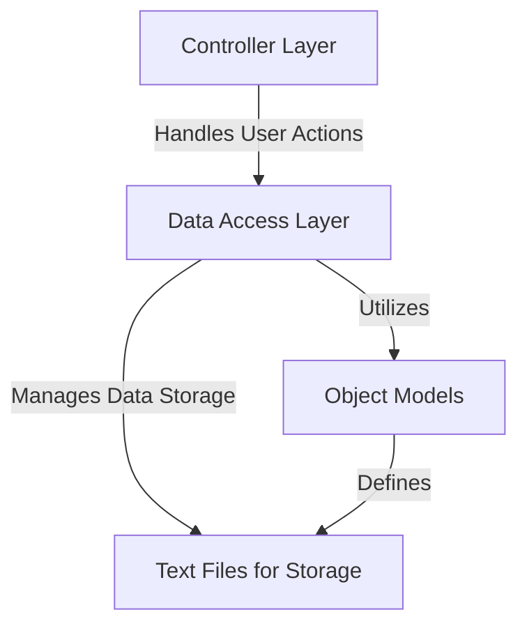

# Grocery Management System 🛒

A Python-based application to efficiently manage grocery inventory, sales, suppliers, employees, and clients.

---

## 📋 Features Overview

The Grocery Management System is a structured solution for handling:
- **Inventory Management**: Add, update, or remove products and their stock.
- **Sales Tracking**: Record and review sales with detailed insights.
- **Supplier Management**: Maintain supplier details and categorize them.
- **Client Records**: Store and manage customer information.
- **Employee Management**: Track and manage employee details.

---

## 📐 System Architecture



---

## 🛠 Installation and Usage

### Installation
1. **Clone the repository**:
   ```bash
   git clone https://github.com/Caio-Felice-Cunha/Grocery-Management.git
   cd Grocery-Management
   ```
2. **Install Python (3.7 or higher)**:
   Ensure Python is installed. You can check with:
   ```bash
   python --version
   ```
3. **Run the Application**:
   Execute the primary script or a test script (if provided):
   ```bash
   python main.py
   ```

---

### Usage

#### Example Commands
1. **Add a Product**:
   ```python
   inventory.registerProduct("Milk", "2.5", "Dairy", 50)
   ```
2. **Track Sales**:
   ```python
   sales.registerSale("Milk", "John Doe", "Jane Doe", 2)
   ```
3. **View Suppliers**:
   ```python
   suppliers.showSuppliers()
   ```
4. **Modify Categories**:
   ```python
   categories.alterCategory("Dairy", "Fresh Dairy")
   ```

---

## 🧑‍💻 Contributing

We welcome contributions! Follow these steps:

### Setting Up
1. Fork the repository.
2. Clone the forked repository to your local system:
   ```bash
   git clone https://github.com/your-username/Grocery-Management.git
   cd Grocery-Management
   ```
3. Create a new branch for your feature:
   ```bash
   git checkout -b feature-name
   ```

### Making Changes
1. Install required dependencies if any.
2. Ensure your code follows the existing structure and style.
3. Test your changes thoroughly.

### Submitting Pull Requests
1. Commit your changes:
   ```bash
   git commit -m "Added feature-name"
   ```
2. Push to your branch:
   ```bash
   git push origin feature-name
   ```
3. Create a pull request on GitHub.

---

## 🔧 Known Issues and Future Plans

### Known Issues
- Limited support for concurrent file access.
- No GUI or web-based interface; CLI only.

### Future Plans
- Add a database backend for scalability.
- Implement a web-based user interface.
- Enhance reporting capabilities.

---

## 📜 License

This project is licensed under the MIT License. For more details, refer to the `LICENSE` file.

```text
MIT License
Copyright (c) 2024 Caio Felice Cunha

Permission is hereby granted, free of charge, to any person obtaining a copy
of this software and associated documentation files (the "Software"), to deal
in the Software without restriction, including without limitation the rights
to use, copy, modify, merge, publish, distribute, sublicense, and/or sell
copies of the Software, and to permit persons to whom the Software is
furnished to do so, subject to the following conditions:
...
```

---

**Start managing your grocery store effectively today!** ✨

---
## ⚖️ Credits

This project was developed as part of the "4 Days 4 Projects" initiative by [Pythonando](https://pythonando.com.br) on YouTube.